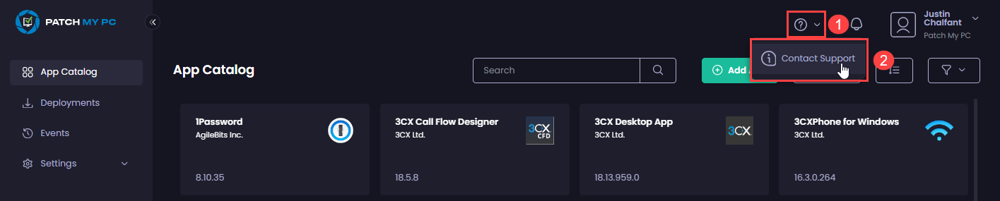

# Contacting Patch My PC Cloud Support

If you encounter any issues with Patch My PC (PMPC) Cloud and need to contact us:

1.  In the header area of the portal, click the "**?**" and select **Contact Support**.\\

    <figure><figcaption>
Clicking the question mark and selecting "Contact Support"
</figcaption></figure>

The **Contact Support** dialog box appears.

.png)

2. Verify that the **From** email address is valid, as this is the email address we will use to contact you.
3. Select the relevant reason for contacting us from the **Subject** dropdown.

.png)

4. Complete the **Description of Issue** field with as much relevant information as possible.

.png)

5. Click **Attach File** and browse to and select a relevant file (such as a ZIP file of logs) that can help us.

.png)

6. Click **Send**

.png)

The **Message sent** notification is shown.

.png)

A Support Engineer will contact you at the provided email address as soon as possible.
