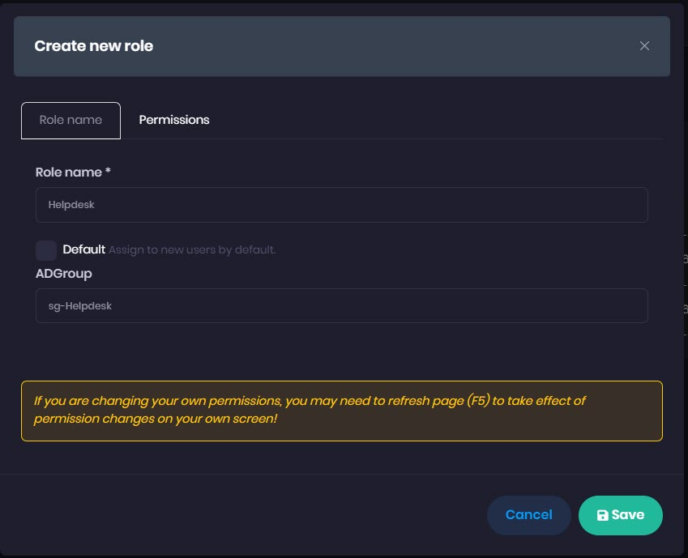

# Advanced Insights Active Directory Group to Role Assignment

_Applies to: Patch My PC Advanced Insights_

Active Directory Group Authentication enables the Advanced Insights administrator to associate Advanced Insights Roles with AD Security Groups. This ensures that a new user is automatically granted the relevant rights in the portal without the need for manual user creation.

To use this feature, first enable Active Directory Authentication using Administration - Settings - User Management, more details [here](https://docs.patchmypc.com/installation-guides/advanced-insights/active-directory-integration).

Once this is configured, we can assign an existing role to an Active Directory Group, or create a new role for a group. **N.B. There is currently no support for nested groups.**

**Assigning a Role to an Active Directory Group**

Navigate to **Administration** > **Roles**.

1. Click Create new role
2. Enter a name for the role (in this example, "Helpdesk"
3. Type the name of the associated Active Directory Security Group, here, we are using "sg-Helpdesk". Ensure the group name is validated on save.

Now click the Permissions tab and select the pages and permissions you want to grant to this role.

.png)

Logging on with an account in the helpdesk role, the user is granted only the access stated in the role configuration:

