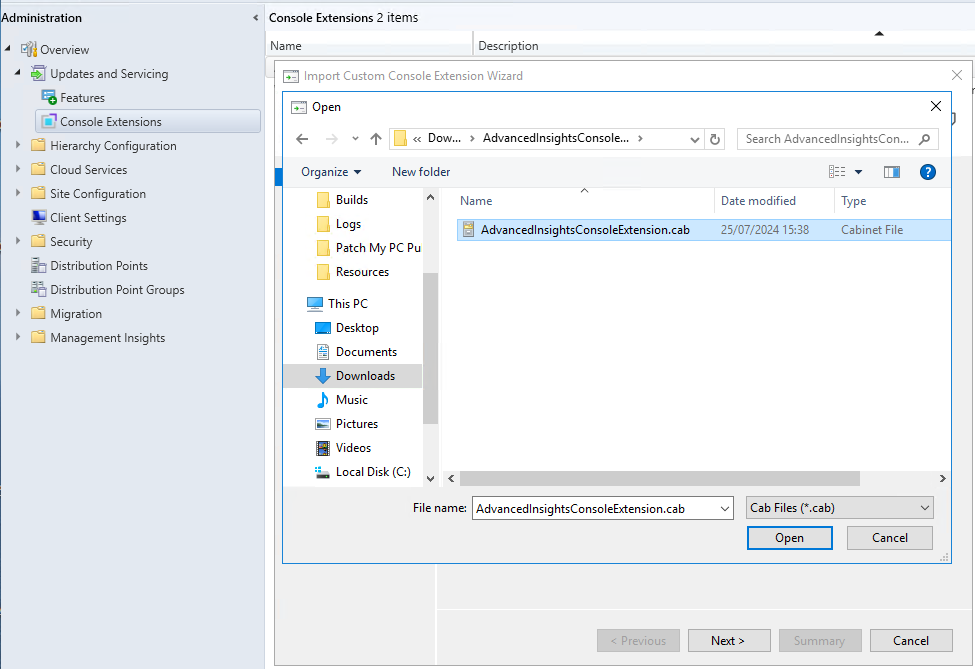

# Advanced Insights Configuration Manager Console Extension

_Applies to: Patch My PC Advanced Insights_

To provide easy access to all dashboards and individual devices, collections, updates, etc. Advanced Insights is provided with an optional Configuration Manager Console Extension. This adds a node to the Assets and Compliance view of the console as well as providing an additional option in the context menu when right-clicking certain object types in the console.

### Download

Download and unzip the Console Extension using the link below.




Warning: The console extension will not work if you are using a **self-signed certificate.**&#x20;


## Installing the Console Extension

To import the Extension, navigate to the Administration node of the Configuration Manager console and expand the Updates and Servicing node. Right click Console Extensions and select "Import Console Extension".

<figure><figcaption>
Import Console  Extension
</figcaption></figure>

Browse to the location of the unzipped Console Extension download.

<figure><figcaption>
Browse to the location of the unzipped download file
</figcaption></figure>

Select the AdvancedInsightsConsoleExtension.cab file and click Open, then click Next, next and Close.

The newly imported Console Extension will be listed alongside any other extensions you have deployed. You must now Approve the Extension by right clicking and selecting "Approve".

<figure><figcaption>
Approving the Extension
</figcaption></figure>

Once approved the Extension can be Installed:

<figure><figcaption>
Installing the Extension
</figcaption></figure>

&#x20;You will be prompted to restart the ConfigMgr Console. When it reloads the Advanced Insights node will have been added tot he Assets and Compliance view:

<figure><figcaption></figcaption></figure>

## First Run


If Advanced Insights is installed on the same server as Configuration Manager, we will try to auto-configure the Extension, so this step may be unnecessary.


When you click the Advanced Insights node, a dialog is displayed in the detail pane asking for the details of your Advanced Insights portal.

<figure><figcaption>
Configuring the Extension
</figcaption></figure>

Provide the relevant URL, including https:// prefix and any required port, for example https://server.contoso.com:444 and click OK. If the address is correct, the Advanced Insights login page will be displayed. You can re-run the configuration step any time by right clicking the Advanced Insights node and selecting "Configuration".&#x20;

<figure><figcaption>
Reconfigure the Extension
</figcaption></figure>

## Using the Extension

The first obvious use of the Extension is to display the Advanced Insights portal right there in the ConfigMgr Console:

<figure><figcaption>
Advanced Insights in the Console
</figcaption></figure>

The second use scenario is to access the rich display capabilities of Advanced Insights when working with Console objects. For example, right-clicking a client and selecting "View in Advanced Insights" will open a new browser window and automatically display the device view for that client.

<figure><figcaption>
View Device in Advanced Insights
</figcaption></figure>

This functionality is available for Devices, Collections, and Updates in the ConfigMgr console.
