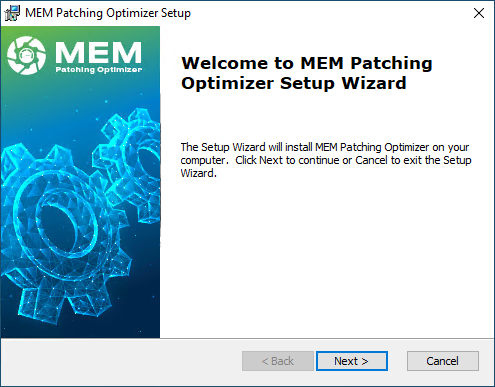

# Download and Install MEM Patching Optimizer

_Applies to: Patch My PC MEM Patching Optimizer_

## Download the EXE Installer


[https://github.com/PatchMyPCTeam/MEM-Patching-Optimizer/releases/latest](https://github.com/PatchMyPCTeam/MEM-Patching-Optimizer/releases/latest)


## Run the Installation

### Welcome Screen

Once the installation starts, you will be greeted by the welcome screen in our installer wizard, click **Next**

<figure><figcaption></figcaption></figure>

### **End-User License Agreement & Install Directory**

By default, this tool is installed in **C:\Program Files\Patch My PC\MEM Performance Analyzer.**

This location is where we store all of the product's configuration information.

Read the End-User License Agreement. After that, select **I accept the terms in the License terms and conditions** and click **Next**.

<figure><figcaption></figcaption></figure>

<figure><figcaption></figcaption></figure>

### Ready to Install

Click **Install**

<figure><figcaption></figcaption></figure>

### Completed

Once the installation has been completed, click **Finish**

<figure><figcaption></figcaption></figure>
