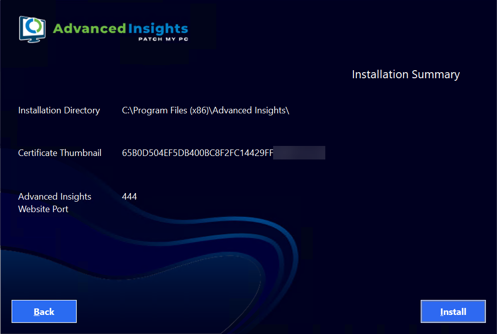

# Cloud Feedback

_Applies to: Patch My PC Cloud_

At Patch My PC (PMPC), we value customer feedback to help us understand if what we create meets your needs, both in terms of usability and functionality.

To help us gather feedback, we have implemented a feedback mechanism into some workflows in PMPC Cloud.

If feedback has been enabled for a workflow, the first time you complete that workflow, the **Rate Your Experience** popup is included as part of the usual notification.

Click on the relevant smiley to indicate your feelings about the workflow. Then provide your comments/feedback, and optionally check the **You can contact me regarding my feedback** checkbox.

Finally, click the green paper airplane icon to send your feedback.

You will then see the **Thank You** notification thanking you for your feedback


**Note**

Once you have submitted your feedback for a workflow, you will not be re-prompted for it again for the same workflow for a period of three months.

However, you will still be prompted for feedback the first time you complete any other workflows for which we have enabled feedback and for which you haven’t submitted feedback.


# Cloud Feedback

_Applies to: Patch My PC Cloud 3_

At Patch My PC (PMPC), we value customer feedback to help us understand if what we create meets your needs, both in terms of usability and functionality.

To help us gather feedback, we have implemented a feedback mechanism into some workflows in PMPC Cloud.

If feedback has been enabled for a workflow, the first time you complete that workflow, the **Rate Your Experience** popup is included as part of the usual notification.

Click on the relevant smiley to indicate your feelings about the workflow. Then provide your comments/feedback, and optionally check the **You can contact me regarding my feedback** checkbox.

Finally, click the green paper airplane icon to send your feedback.

You will then see the **Thank You** notification thanking you for your feedback


**Note**

Once you have submitted your feedback for a workflow, you will not be re-prompted for it again for the same workflow for a period of three months.

However, you will still be prompted for feedback the first time you complete any other workflows for which we have enabled feedback and for which you haven’t submitted feedback.

